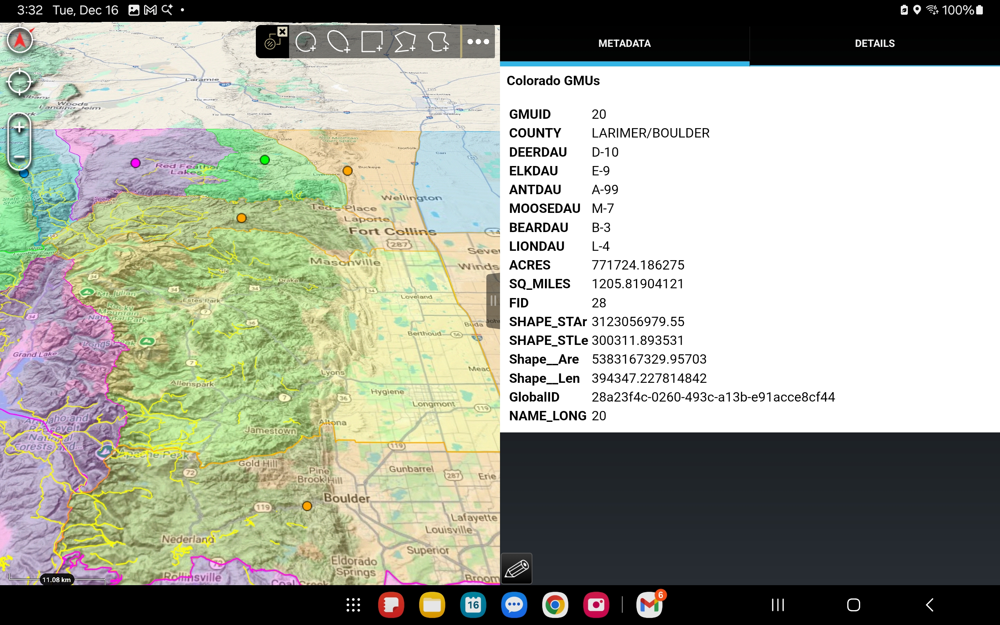

# Colorado Hunting GMUs → ATAK

Purpose: export Colorado Game Management Units (GMUs) into an ATAK-ready KMZ so you can view unit boundaries in the field.

## Inputs
- Download the GMU shapefile from https://geodata.colorado.gov/datasets/2c0794ece2ee4c8d9ac1f64cda8d0216_0/explore and export/download it as a shapefile.
- Extract the contents into `projects/colorado-hunting/inputs/` so that `Game_Management_Units_(GMUs)__CPW.shp` and its sidecar files sit in that folder.

## Requirements
- Python 3 and GDAL/OGR with Python bindings (e.g., `brew install gdal` on macOS).

## How to run
From repo root:
- `python3 projects/colorado-hunting/main.py`
- Output: `projects/colorado-hunting/outputs/CO_GMUs.kmz`

Load the KMZ into ATAK to visualize the GMUs. Delete or ignore old outputs if you want a clean drop.***

Quick start: export Colorado Game Management Units to ATAK KMZ. Download the GMU shapefile from https://geodata.colorado.gov/datasets/2c0794ece2ee4c8d9ac1f64cda8d0216_0/explore into `projects/colorado-hunting/inputs/`, then run `projects/colorado-hunting/main.py`.

## Screenshot
- 
