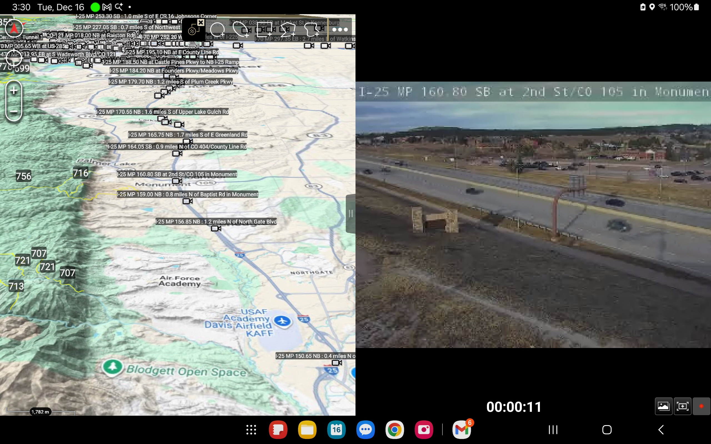

# Colorado CoTrip Traffic Cameras

Quick utilities for turning the CoTrip camera feed export (`co_cotrip_cameras.json`) into ATAK overlays. The goal is simple: make the Colorado CoTrip camera feeds (see https://maps.cotrip.org/list/events) viewable directly in ATAK. Each Camera shows up as a camera icon on the ATAK map.

## What's here
- `cotrip.py` — queries the CoTrip GraphQL APIs to pull all camera metadata, coordinates, and HLS URLs into `co_cotrip_cameras.json`.
- `convert_cot.py` — builds a CoT mission package (`co_cotrip_cameras_mp.zip`) with ready-to-play video entries in the provided CoT format.
- `co_cotrip_cameras.json` — source camera listing (URI/title/lat/lon/HLS).
- `outputs/` — generated files land here.

## Usage
Requirements: Python 3 (stdlib only).

From this folder:
- Refresh camera data: `python3 cotrip.py` → updates `co_cotrip_cameras.json` with camera locations and HLS sources.
- CoT package: `python3 convert_cot.py` → creates `outputs/co_cotrip_cameras_mp.zip` and per-camera `.cot` files (requires `co_cotrip_cameras.json`).

If you have a newer JSON export, replace `co_cotrip_cameras.json` then rerun the scripts. Delete or ignore old files in `outputs/` if you want a clean drop.***

Note: the output is a CoT mission data package (ZIP with `.cot` files), not a KML/KMZ. Import the ZIP into ATAK as a data package to see the camera markers and launch HLS streams.

## Screenshot
- 
