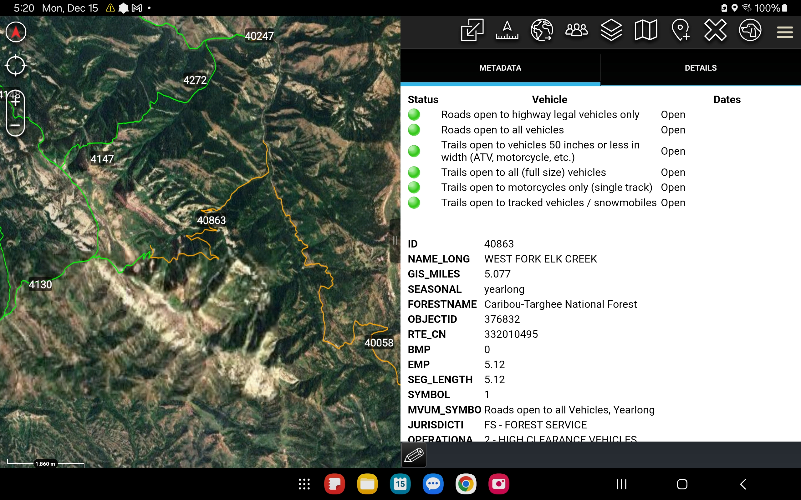
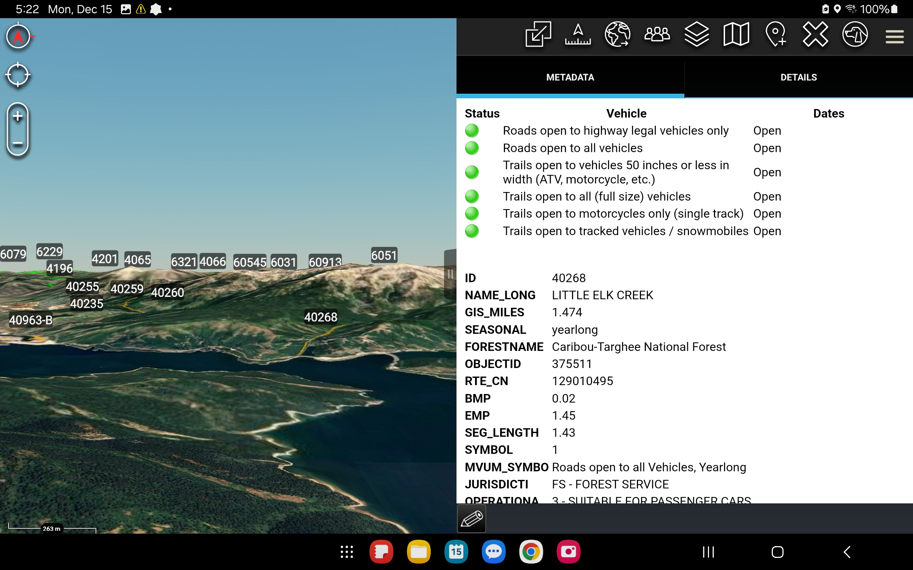

USFS MVUM KML/KMZ Generator
----------------------

Exports the USFS Motor Vehicle Use Map (MVUM) shapefiles to ATAK-friendly KML/KMZ with per-state splits and vehicle-access legends.

Project layout
- `inputs/` — drop the MVUM shapefile sets here (roads and trails). Expected filenames:
  - `MVUM_Symbology_-_Motor_Vehicle_Use_Map_Trails.shp` (plus .dbf/.shx/.prj/.cpg/.xml/.cpg)
  - `MVUM_Symbology_-_Motor_Vehicle_Use_Map_Roads.shp` (plus .dbf/.shx/.prj/.cpg/.xml/.cpg)
- `outputs/` — generated KML/KMZ files are written here.
- `main.py` — driver script; configuration lives at the top.

Why the KML looks this way
- Labels: ATAK ignores labels on pure LineString placemarks, so a Point is embedded into each Placemark (MultiGeometry) to anchor labels while keeping the line. Labels use `ID`, falling back to `NAME`.
- Metadata: Builds an HTML `<description>` wrapped in CDATA and duplicates attributes into `<ExtendedData><Data>` so ATAK shows the full table. Includes a vehicle-access legend with green/red styling and surfaces `NAME_LONG`, `GIS_MILES`, `SEASONAL`, and `FORESTNAME` for quick scanning.
- Organization: Trails and roads live in separate top-level KML folders so you can toggle them independently.
- *Styling*: Trails use green/red (allowed/denied); roads use orange when any motorized vehicle is allowed and red when none are allowed.

Screenshots
- 
- 

How to run
1) Install GDAL/OGR with Python bindings (ogrinfo/VectorTranslate available in PATH). On macOS with Homebrew: `brew install gdal`.
2) Download the MVUM shapefiles and place them in `inputs/` (extract the zips so all components are together):
   - Trails: https://apps.fs.usda.gov/arcx/rest/services/EDW/EDW_MVUM_01/MapServer/0 (export as Shapefile)
   - Roads:  https://apps.fs.usda.gov/arcx/rest/services/EDW/EDW_MVUM_01/MapServer/1 (export as Shapefile)
3) Adjust config at the top of `main.py` if needed:
   - `RUN_ALL_STATES`: keep True to process all bounding boxes in `STATE_BBOXES`; set False and edit `DEFAULT_STATES` for a subset.
   - `STATE_BBOXES`: per-state bounding boxes (minx, miny, maxx, maxy) for CONUS + AK/HI.
   - Style values (colors, label scale) are nearby.
4) Run: `python3 main.py`
5) Check `outputs/` for per-state KML/KMZ:
   - `MVUM_{STATE}_trails.kml`, `MVUM_{STATE}_roads.kml`, and combined `MVUM_{STATE}.kmz`.
   - `MVUM_states.zip` bundles all per-state KMZs.

Notes
- Generation is always per-state; non-state/full-dataset output is not supported.
- If a state has no trails or roads in its bbox, it’s skipped. Intermediate KMLs are deleted after KMZ creation to keep `outputs/` tidy.
- When loading into ATAK, importing KMZ/KML files one at a time tends to perform better than bulk imports.
